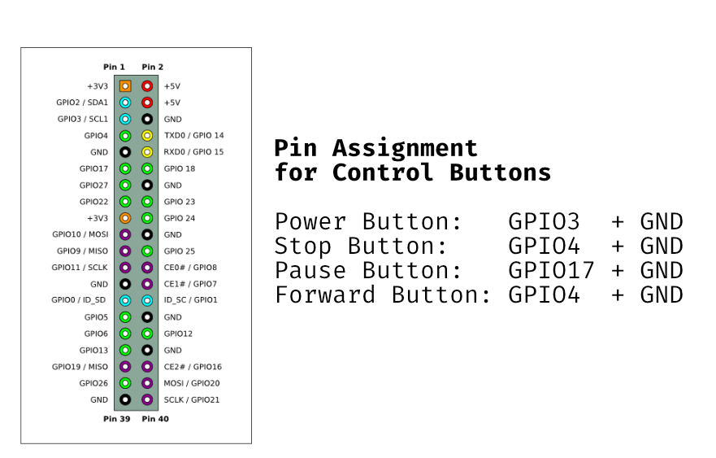

# RFID Media Player on Raspberry Pi

Playing video and audio files triggered by RFID cards on raspberry pi using OMXPlayer. Button controls for pause, skip, back and forward.

## Hardware

- Raspberry Pi 3b
- Neuftech USB RFID Reader
- 125 kHz RFID cards

## Setup Guide

1.  Setup a raspberry pi with Raspberry OS
2.  Clone this project to /home/pi
3.  Make sure OMXPlayer module is installed

        pip3 install omxplayer-wrapper

4.  Move your files into assets folder
5.  Modify media_list in reader.py to include your filepaths and codes for the RFID Tags
6.  Start reader.py

## Running the script on startup

To run the reader when the py is started, add it to .bashrc

Edit .bashrc with nano

    sudo nano /home/pi/.bashrc

At the end of the file add:

    echo Running at boot
    sudo python3 /home/pi/Raspi_RFID_player/reader.py

See [link](https://www.dexterindustries.com/howto/run-a-program-on-your-raspberry-pi-at-startup/) for more detailed instruction

## Adding Button Controls

The projects already includes buttons for pausing media, stopping media (killing OMX processes) and shutting down the raspberry pi.
The buttons are mapped to following pins:

